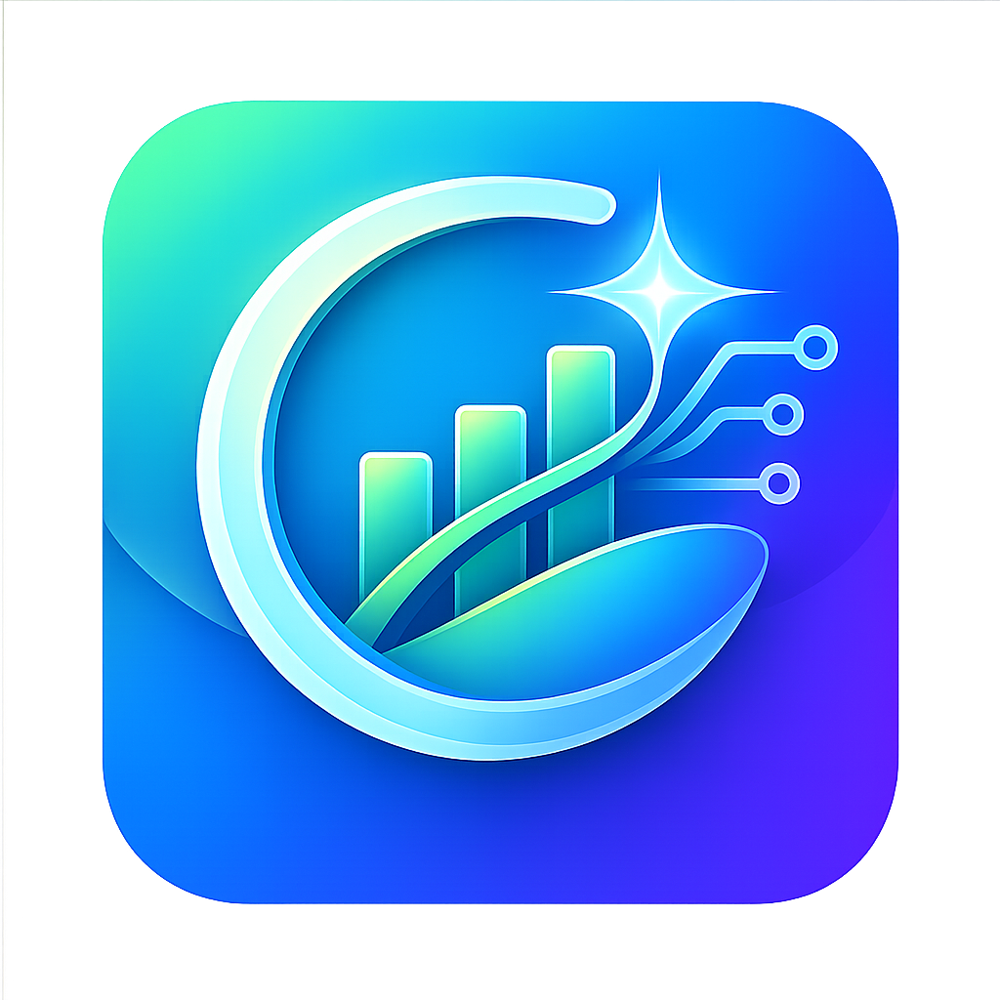

<p align="center">
  <picture>
    <source media="(prefers-color-scheme: dark)" srcset="https://raw.githubusercontent.com/lamhuetrung/lamhuetam/main/public/logo_192.png">
    
  </picture>
</p>

<h1 align="center">Tài Chính Cá Nhân</h1>

<p align="center">
  <b>Personal Finance Manager</b> — <i>AI-Powered · Offline-First · PWA</i>
</p>

<p align="center">
  
  
  
  
  
  
  
  <br>
  
  
  
  
</p>

---

## ✦ Tổng Quan

**Tài Chính Cá Nhân** là ứng dụng web PWA toàn diện giúp bạn kiểm soát dòng tiền, theo dõi chi tiêu, quản lý nợ, tiết kiệm và lập kế hoạch tài chính — tất cả được hỗ trợ bởi **trí tuệ nhân tạo Gemini**.

Thiết kế theo ngôn ngữ **iOS Human Interface**, tối ưu trải nghiệm di động và desktop. Hoạt động **offline-first**, đồng bộ dữ liệu thông minh qua đám mây.

> _"Quản lý tài chính không chỉ là con số — đó là nghệ thuật sống."_

---

## ✦ Tính Năng Nổi Bật

### Quản Lý Tài Chính

| Tính năng         | Mô tả                                                                        |
| ----------------- | ---------------------------------------------------------------------------- |
| Giao dịch thu/chi | Thêm, sửa, xóa, lọc theo danh mục, ví, ngày tháng                            |
| Sổ cái thông minh | Lịch tháng grid + danh sách giao dịch theo ngày                              |
| Ngân sách         | Đặt hạn mức chi tiêu theo từng danh mục                                      |
| Công nợ           | Quản lý nợ trả góp, thẻ tín dụng, vay bạn bè — tính lãi, thanh toán nhiều kỳ |
| Tiết kiệm         | Tạo mục tiêu, nạp/rút quỹ, theo dõi tiến độ                                  |
| Chi tiêu cố định  | Quản lý các khoản chi định kỳ (nhà, điện, nước, mạng...)                     |
| Lương             | Cấu hình lương gross/net, tự động công lương hàng tháng                      |
| Dự báo dòng tiền  | Mô phỏng thu nhập — chi phí — trả nợ — còn lại                               |

### AI & Thông Minh

| Tính năng               | Mô tả                                                              |
| ----------------------- | ------------------------------------------------------------------ |
| **Cố vấn AI**           | Chat với Gemini — phân tích tài chính, tối ưu nợ, tư vấn tiết kiệm |
| **Gợi ý danh mục**      | AI tự động nhận diện danh mục từ mô tả giao dịch                   |
| **OCR hóa đơn**         | Quét hóa đơn bằng camera, tự động điền giao dịch                   |
| **Cảnh báo bất thường** | AI phát hiện biến động tài chính bất thường                        |

### Nhật Ký & Cá Nhân

| Tính năng       | Mô tả                                                           |
| --------------- | --------------------------------------------------------------- |
| Nhật ký đa diện | 4 chế độ xem: Timeline, Tree, Map (Leaflet + VietMap), Calendar |
| Tâm trạng       | 7 loại cảm xúc, thống kê phân bố, streak ngày viết liên tục     |
| GPS tự động     | Lấy tọa độ + reverse geocoding (Nominatim) khi viết nhật ký     |
| Hồ sơ cá nhân   | Kỹ năng, công nghệ, học vấn, custom fields                      |
| Cấu hình AI     | Chọn model, nhập API Key, test kết nối                          |

### Offline & PWA

| Tính năng       | Mô tả                                                  |
| --------------- | ------------------------------------------------------ |
| Offline-first   | Ghi vào IndexedDB trước, đồng bộ lên cloud khi online  |
| Đồng bộ 2 chiều | Sync queue thông minh — không lo mất dữ liệu           |
| PWA             | Cài đặt lên màn hình chính, hoạt động offline một phần |
| Chế độ tối      | Dark mode chuyển đổi mượt mà                           |

---

## ✦ Màn Hình

```
 ┌─────────────────────────────────────────┐
 │              BOTTOM NAV                 │
 ├──────┬──────┬──────┬──────┬──────┬──────┤
 │ Tổng │ Sổ   │ Thêm │ Tài  │ Cố   │ Nhật │
 │ quan │ cái  │ nhanh│ chính│ vấn  │ ký   │
 │      │      │  ✚   │      │  AI  │      │
 ├──────┴──────┴──────┴──────┴──────┴──────┤
 │              iOS Style Tab Bar           │
 └─────────────────────────────────────────┘
```

| #   | Màn hình       | Mô tả ngắn                                                                 |
| --- | -------------- | -------------------------------------------------------------------------- |
| 1   | **Tổng quan**  | Dashboard — biểu đồ xu hướng, cơ cấu thu/chi, dự báo dòng tiền, AI insight |
| 2   | **Sổ cái**     | Lịch sử giao dịch — calendar grid + filter + tìm kiếm                      |
| 3   | **Thêm nhanh** | Bottom sheet — thêm giao dịch thu/chi với AI suggest category              |
| 4   | **Tài chính**  | 4 tab: Công nợ · Dòng tiền · Lương · Chi tiêu cố định                      |
| 5   | **Cố vấn AI**  | Chat với Gemini — phân tích tài chính, hỏi đáp thông minh                  |
| 6   | **Nhật ký**    | 4 chế độ: Timeline · Tree · Map · Calendar — ghi lại cuộc sống             |
| 7   | **Hồ sơ**      | Thông tin cá nhân, kỹ năng, cấu hình AI                                    |

---

## ✦ Công Nghệ

### Frontend

| Công nghệ                 | Mục đích                       |
| ------------------------- | ------------------------------ |
| **React 19**              | UI Framework                   |
| **TypeScript 5.8**        | Ngôn ngữ — strict mode         |
| **Vite 6**                | Build tool, HMR                |
| **Tailwind CSS 4**        | Utility CSS                    |
| **Motion**                | Animation mượt mà              |
| **Recharts**              | Biểu đồ (Line, Bar, Pie, Area) |
| **Material Design Icons** | 7000+ icon                     |
| **react-markdown**        | Render nội dung AI             |
| **react-hot-toast**       | Toast notification             |

### Backend & Database

| Công nghệ             | Mục đích                       |
| --------------------- | ------------------------------ |
| **Netlify Functions** | Serverless API (15+ functions) |
| **MongoDB Atlas**     | Database — Mongoose ODM        |
| **JWT + bcryptjs**    | Authentication                 |

### PWA & Offline

| Công nghệ           | Mục đích           |
| ------------------- | ------------------ |
| **Dexie.js**        | IndexedDB wrapper  |
| **vite-plugin-pwa** | PWA + Workbox      |
| **Service Worker**  | Cache strategy     |
| **syncService**     | Offline sync queue |

### AI

| Công nghệ             | Mục đích                           |
| --------------------- | ---------------------------------- |
| **Google Gemini API** | Cố vấn tài chính, OCR, suggest     |
| **Multiple Provider** | OpenRouter, NVIDIA NIM, FreeLLMAPI |

### Bản Đồ

| Công nghệ         | Mục đích                               |
| ----------------- | -------------------------------------- |
| **Leaflet**       | Map rendering                          |
| **VietMap tiles** | Bản đồ Việt Nam (hành chính + vệ tinh) |
| **Nominatim**     | Reverse geocoding                      |

---

## ✦ Kiến Trúc

```
┌──────────────────────────────────────────┐
│            React SPA (PWA)               │
│  ┌──────────┐  ┌──────────────────────┐  │
│  │  UI Layer │  │  State (Context)     │  │
│  │  (Comps)  │  │  + LocalStorage     │  │
│  └────┬─────┘  └──────────┬───────────┘  │
│       │                    │              │
│  ┌────▼────────────────────▼───────────┐  │
│  │        IndexedDB (Dexie)            │  │
│  │        + Sync Queue                 │  │
│  └────────────────┬────────────────────┘  │
└───────────────────┬───────────────────────┘
                    │
              ┌─────▼──────┐
              │  Netlify   │
              │ Functions  │
              │ (15 APIs)  │
              └─────┬──────┘
                    │
              ┌─────▼──────┐
              │  MongoDB   │
              │  Atlas     │
              └────────────┘
```

### Nguyên lý hoạt động

1. **Offline-first:** Mọi thao tác CRUD ghi vào IndexedDB ngay lập tức
2. **Sync queue:** Khi online, đồng bộ lên server theo thứ tự FIFO
3. **Cache strategy:** API response được cache — giảm thiểu request
4. **AI Integration:** Hỗ trợ nhiều provider qua cấu hình endpoint linh hoạt

---

## ✦ Cài Đặt & Phát Triển

### Yêu cầu

- **Node.js** >= 18
- **npm** / **yarn** / **pnpm**
- **MongoDB Atlas** cluster (hoặc MongoDB local)
- **Netlify CLI** (cho serverless functions)

### Cài đặt

```bash
# Clone repository
git clone https://github.com/lamhuetrung/lamhuetam.git
cd lamhuetam

# Cài dependencies
npm install

# Tạo file .env (tham khảo .env.example)
cp .env.example .env
```

### Biến môi trường

Tạo file `.env` với nội dung:

```env
# MongoDB
MONGODB_URI=mongodb+srv://<user>:<pass>@cluster.xxxxx.mongodb.net/lamhuetam

# JWT
JWT_SECRET=your-secret-key

# AI Provider (ví dụ OpenRouter)
AI_API_KEY=sk-or-v1-xxxxx
AI_MODEL=google/gemini-2.0-flash-001
AI_BASE_URL=https://openrouter.ai/api/v1

# Discord Bot (tùy chọn)
DISCORD_PUBLIC_KEY=your-discord-public-key
```

### Chạy development

```bash
# Frontend + Netlify Functions
npm run dev
```

Truy cập `http://localhost:5173`

### Build production

```bash
npm run build
```

---

## ✦ API Endpoints

| Endpoint                | Method       | Mô tả              |
| ----------------------- | ------------ | ------------------ |
| `/api/auth/login`       | POST         | Đăng nhập          |
| `/api/auth/register`    | POST         | Đăng ký            |
| `/api/transactions`     | GET/POST     | Giao dịch          |
| `/api/transactions/:id` | PUT/DELETE   | Chi tiết giao dịch |
| `/api/budgets`          | GET/POST/PUT | Ngân sách          |
| `/api/debts`            | GET/POST     | Công nợ            |
| `/api/debts/:id`        | PUT/DELETE   | Chi tiết nợ        |
| `/api/savings`          | GET/POST     | Tiết kiệm          |
| `/api/savings/:id`      | PUT/DELETE   | Chi tiết tiết kiệm |
| `/api/categories`       | GET/POST     | Danh mục           |
| `/api/salary`           | GET/POST/PUT | Cấu hình lương     |
| `/api/fixed-expenses`   | GET/POST     | Chi tiêu cố định   |
| `/api/diary`            | GET/POST     | Nhật ký            |
| `/api/profile`          | GET/PUT      | Hồ sơ cá nhân      |
| `/api/ai-config`        | GET/PUT      | Cấu hình AI        |
| `/api/gemini-advisor`   | POST         | Cố vấn AI          |
| `/api/gemini-ocr`       | POST         | OCR hóa đơn        |
| `/api/gemini-timeline`  | POST         | Phân tích timeline |

---

## ✦ Đóng Góp

Mọi đóng góp đều được chào đón! Hãy tạo **Issue** hoặc **Pull Request**.

1. Fork project
2. Tạo branch feature (`git checkout -b feature/AmazingFeature`)
3. Commit changes (`git commit -m 'Add AmazingFeature'`)
4. Push lên branch (`git push origin feature/AmazingFeature`)
5. Mở Pull Request

---

## ✦ Giấy Phép

Distributed under the **MIT License**.

---

<p align="center">
  <sub>Được xây dựng với ❤️ bởi <b>Lam Hue Trung</b></sub>
  <br>
  <sub><i>Kiểm soát tài chính — Kiến tạo tương lai</i></sub>
</p>
